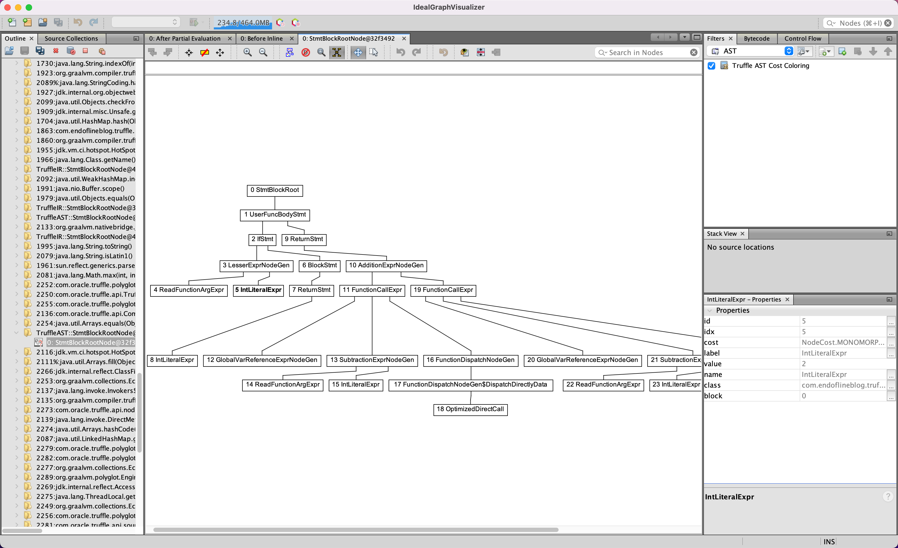

# Part 9 - performance benchmarking

In this part of the series,
we benchmark the performance of our EasyScript interpreter,
and fix some performance issues that we find.

## The benchmark

The benchmark is written using the [JMH library](https://github.com/openjdk/jmh).
We introduce [a superclass, `TruffleBenchmark`](src/jmh/java/com/endoflineblog/truffle/part_09/TruffleBenchmark.java),
that holds the common configuration of the benchmark
(how long should the warmup and measurement phases be,
what units to measure the performance in,
the options to pass to the JVM the benchmarks execute in, etc.).
The actual measured code extends `TruffleBenchmark`,
and is kept in the [`FibonacciBenchmark` class](src/jmh/java/com/endoflineblog/truffle/part_09/FibonacciBenchmark.java).

We use a naive implementation of the Fibonacci function as the measured code.
In addition to EasyScript, we also implement benchmarks for Java,
the GraalVM JavaScript Truffle implementation
(which used to come bundled with GraalVM,
but since version `22`, is now a
[separate library](https://mvnrepository.com/artifact/org.graalvm.js/js)),
and also [SimpleLanguage](https://www.graalvm.org/latest/graalvm-as-a-platform/implement-language),
for comparison.

The initial numbers I get on my laptop when executing the benchmark command
(`./gradlew :part-09:jmh`) with the interpreter code from [the previous part](../part-08):

```
Benchmark                              Mode  Cnt     Score     Error  Units
FibonacciBenchmark.recursive_eval_ezs  avgt    5  6028.256 ± 421.844  us/op
FibonacciBenchmark.recursive_eval_js   avgt    5    78.143 ±   3.453  us/op
FibonacciBenchmark.recursive_eval_sl   avgt    5    55.662 ±   3.395  us/op
FibonacciBenchmark.recursive_java      avgt    5    38.383 ±   1.046  us/op
```

Clearly, our interpreter needs some work to catch up to the performance of the JavaScript and SimpleLanguage implementations.

## Supporting subtraction

The naive Fibonacci function implementation uses subtraction,
which the interpreter from [part 8](../part-08) does not support.
Given that, we need to add support for it to our language.

The change is relatively straightforward:
we change the [existing rule in the grammar for addition](src/main/antlr/com/endoflineblog/truffle/part_09/parsing/antlr/EasyScript.g4)
to also allow subtraction.
We handle the two possible symbols that we can have in that rule in the
[`EasyScriptTruffleParser` class](src/main/java/com/endoflineblog/truffle/part_09/parsing/EasyScriptTruffleParser.java).
The implementation of the [subtraction Truffle Node itself](src/main/java/com/endoflineblog/truffle/part_09/nodes/exprs/arithmetic/SubtractionExprNode.java)
is very similar to the [addition Node](src/main/java/com/endoflineblog/truffle/part_09/nodes/exprs/arithmetic/AdditionExprNode.java).

## Performance improvements

In order to improve the performance of our interpreter,
we make the following changes to it:

* We refactor the implementation of
  [`executeStatement()` in the block statement Node](src/main/java/com/endoflineblog/truffle/part_09/nodes/stmts/blocks/BlockStmtNode.java)
  to avoid redundant assignments.
* We make the [`FunctionObject` class](src/main/java/com/endoflineblog/truffle/part_09/runtime/FunctionObject.java)
  mutable with the `redefine()` method.
  We also add an `Assumption` that confirms a function was not redefined since its `CallTarget` was last referenced.
* We change the [function dispatch code](src/main/java/com/endoflineblog/truffle/part_09/nodes/exprs/functions/FunctionDispatchNode.java)
  to check this `Assumption` in the `dispatchDirectly()` specialization
* We change the API of [defining a global function](src/main/java/com/endoflineblog/truffle/part_09/runtime/GlobalScopeObject.java)
  to call the `FunctionObject.redefine()` method if a function already exists,
  instead of always creating a new `FunctionObject` instance
* We add caching to the [function declaration Node](src/main/java/com/endoflineblog/truffle/part_09/nodes/stmts/variables/FuncDeclStmtNode.java),
  so that it doesn't create a new `CallTarget` every time it's executed
  (as they all would have the same behavior anyway)
* Since we now always return the same `FunctionObject` instance from our `GlobalScopeObject` class,
  we add [caching to the global reference Node in case it resolves to a function](src/main/java/com/endoflineblog/truffle/part_09/nodes/exprs/variables/GlobalVarReferenceExprNode.java)
* We only check if a variable with the same name already exists on the
  [first execution of its declaration](src/main/java/com/endoflineblog/truffle/part_09/nodes/stmts/variables/GlobalVarDeclStmtNode.java) -
  otherwise, executing the same Truffle AST multiple times
  (which is how `Context.eval()` works, as it caches the AST to avoid re-parsing your code)
  would fail

With these changes, re-running the benchmark produces the following numbers:

```
Benchmark                              Mode  Cnt    Score   Error  Units
FibonacciBenchmark.recursive_eval_ezs  avgt    5  102.190 ± 1.099  us/op
```

We have achieved almost a 60x speedup compared to the version from [part 8](../part-08).

## Using Ideal Graph Visualizer

When diagnosing performance issues,
the [Ideal Graph Visualizer tool](https://www.graalvm.org/latest/tools/igv)
is very helpful.
It’s a project maintained by the same team that maintains GraalVM and Truffle,
and allows visualizing as graphs the many debug trees that Truffle and Graal produce in the process of interpreting your language.

To have your Truffle interpreter emit graphs to consume in IGV,
you need to add the `-Dgraal.Dump=:1` JVM argument when starting it.
You can send the dumps directly to the program with the `-Dgraal.PrintGraph=Network`,
or to a specific file by passing the `-Dgraal.DumpPath` argument
(the default is to save them in the `graal_dumps` folder in the current directory if they cannot be delivered to a running instance of IGV).

For example, to dump the data from the EasyScript benchmark,
you can add the appropriate JVM arguments in the benchmark configuration:

```java
    @Fork(jvmArgsPrepend = {
            "-Dgraal.Dump=:1",
            "-Dgraal.PrintGraph=Network"
    })
    @Benchmark
    public int recursive_eval_ezs() {
        return this.truffleContext.eval("ezs", FIBONACCI_JS_PROGRAM).asInt();
    }
```

After [downloading IGV](https://www.oracle.com/downloads/graalvm-downloads.html)
(it's under the "Archived Enterprise Releases" tab),
run it by executing `./idealgraphvisualizer`
in the `bin` directory of the downloaded and uncompressed program.
Now, when running the benchmark, you should see in the output:

```shell-session
[Use -Dgraal.LogFile=<path> to redirect Graal log output to a file.]
Connected to the IGV on 127.0.0.1:4445
```

And a bunch of graphs should appear in the "Outline" menu on the left:


