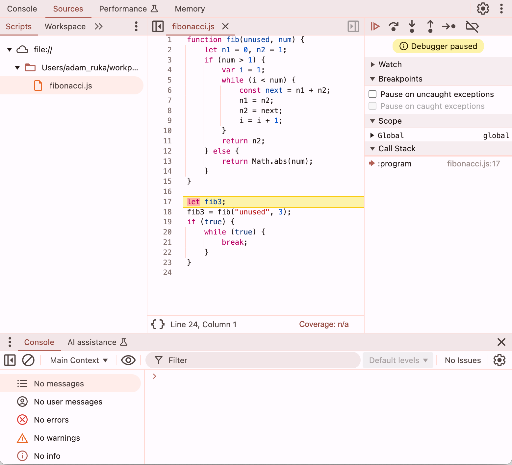
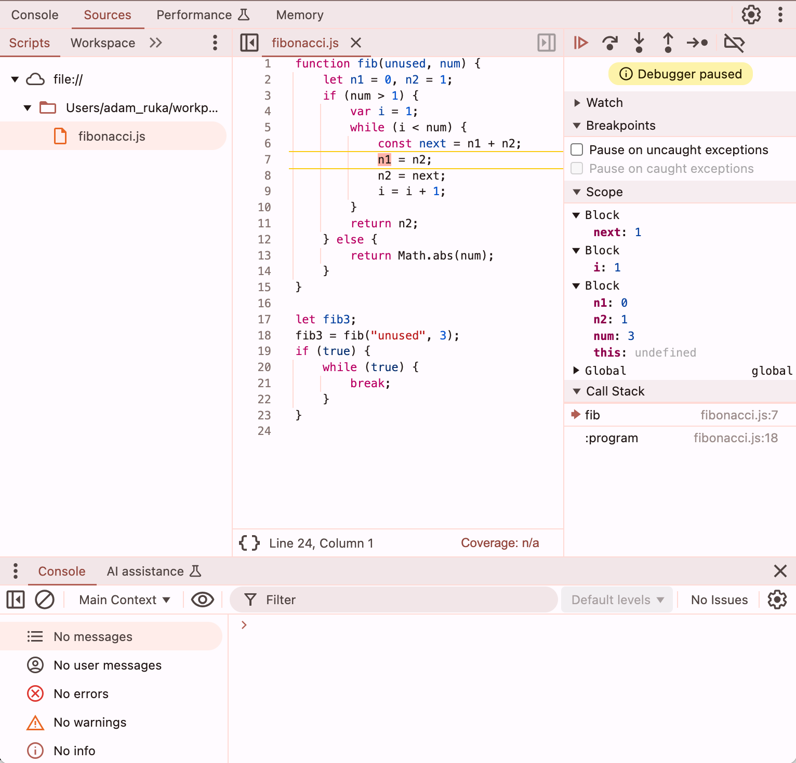

# Part 16 - debuggers

In this part of the series,
we add support for debugging EasyScript,
our simplified subset of JavaScript,
using [Chrome DevTools](https://developer.chrome.com/docs/devtools).

Unlike the previous parts of the series,
we won't have to make any changes to the language's grammar,
or add any new language features -
however, we'll have to heavily modify our existing implementation.

## Instrumentation

Debuggers require Nodes to be instrumented,
which means implementing the
[`InstrumentableNode` interface](https://www.graalvm.org/truffle/javadoc/com/oracle/truffle/api/instrumentation/InstrumentableNode.html).
We do that in the
[`EasyScriptStmtNode` class](src/main/java/com/endoflineblog/truffle/part_16/nodes/stmts/EasyScriptStmtNode.java).
To help with implementing the
[`createWrapper()` method](https://www.graalvm.org/truffle/javadoc/com/oracle/truffle/api/instrumentation/InstrumentableNode.html#createWrapper(com.oracle.truffle.api.instrumentation.ProbeNode)),
we annotate the `EasyScriptStmtNode` class with the
[`@GenerateWrapper` annotation](https://www.graalvm.org/truffle/javadoc/com/oracle/truffle/api/instrumentation/GenerateWrapper.html)
from the Truffle DSL.
We also return `true` for the
[`StatementTag` standard tag](https://www.graalvm.org/truffle/javadoc/com/oracle/truffle/api/instrumentation/StandardTags.StatementTag.html)
in the [`hasTag()` method](https://www.graalvm.org/truffle/javadoc/com/oracle/truffle/api/instrumentation/InstrumentableNode.html#hasTag(java.lang.Class)),
which is how the debugger recognizes which Nodes represent statements.
Since all Nodes that provide one of the
[`StandardTags`](https://www.graalvm.org/truffle/javadoc/com/oracle/truffle/api/instrumentation/StandardTags.html)
must also provide
[a `SourceSection`](https://www.graalvm.org/truffle/javadoc/com/oracle/truffle/api/source/SourceSection.html),
we will add a field of that type to the
[`EasyScriptStmtNode` class](src/main/java/com/endoflineblog/truffle/part_16/nodes/stmts/EasyScriptStmtNode.java),
and add a parameter for it to the class's constructor,
and use the field in the override of the
[`getSourceSection()` method](https://www.graalvm.org/truffle/javadoc/com/oracle/truffle/api/nodes/Node.html#getSourceSection())
(this means we need to modify all subclasses of `EasyScriptStmtNode`
to pass a `SourceSection` to its constructor).

While we want the debugger to be able to stop on almost all statements,
a few of them are special, and we want the debugger to skip past them.
One example is a function declaration -- there's little point in stepping into one
(a function _invocation_ is a different story, but not a function _declaration_).
For that reason, we make sure to pass a `null` `SourceSection` to `EasyScriptStmtNode`
from the [`FuncDeclStmtNode` class](src/main/java/com/endoflineblog/truffle/part_16/nodes/stmts/variables/FuncDeclStmtNode.java),
and also override the
[`hasTag()` method](https://www.graalvm.org/truffle/javadoc/com/oracle/truffle/api/instrumentation/InstrumentableNode.html#hasTag(java.lang.Class))
in it to always return `false`
(since Nodes providing standard tags must have a `SourceSection`).

Similarly, class declarations are also not interesting,
for the same reasons as function declarations.
Since those don't have a dedicated statement, but instead use the
[`GlobalVarDeclStmtNode` class](src/main/java/com/endoflineblog/truffle/part_16/nodes/stmts/variables/GlobalVarDeclStmtNode.java),
we will also override the
[`hasTag()` method](https://www.graalvm.org/truffle/javadoc/com/oracle/truffle/api/instrumentation/InstrumentableNode.html#hasTag(java.lang.Class))
in it to check whether a given `GlobalVarDeclStmtNode` has a non-`null` `SourceSection`,
and only provide the `StatementTag` for it if it does.
We'll make sure to pass a `null` `SourceSection` to the `GlobalVarDeclStmtNode`
constructor when parsing a class declaration,
but we still want the debugger to stop on non-class global variable declarations,
since their initializers can be complex expressions that we might want to step through.

In order to correctly support functionality like Step Over and Step Into,
we need to mark function calls boundaries.
We do that by overriding the [`hasTag()` method](https://www.graalvm.org/truffle/javadoc/com/oracle/truffle/api/instrumentation/InstrumentableNode.html#hasTag(java.lang.Class))
in the [`UserFuncBodyStmtNode` class](src/main/java/com/endoflineblog/truffle/part_16/nodes/stmts/blocks/UserFuncBodyStmtNode.java)
to return `true` for the
[`RootTag` standard tag](https://www.graalvm.org/truffle/javadoc/com/oracle/truffle/api/instrumentation/StandardTags.RootTag.html).

We need to do the same for the block that represents the first level of the main program.
So, we add a boolean property to the
[`BlockStmtNode` class](src/main/java/com/endoflineblog/truffle/part_16/nodes/stmts/blocks/BlockStmtNode.java),
`programBlock`, and make it return `true` in the
[`hasTag()` method](https://www.graalvm.org/truffle/javadoc/com/oracle/truffle/api/instrumentation/InstrumentableNode.html#hasTag(java.lang.Class))
for the [`RootTag` standard tag](https://www.graalvm.org/truffle/javadoc/com/oracle/truffle/api/instrumentation/StandardTags.RootTag.html)
if `programBlock` is also `true`.

Any tags provided by the language's Nodes need to be registered in the corresponding
[`TruffleLanguage` class](src/main/java/com/endoflineblog/truffle/part_16/EasyScriptTruffleLanguage.java)
by annotating it with the
[`@ProvidedTags` annotation](https://www.graalvm.org/truffle/javadoc/com/oracle/truffle/api/instrumentation/ProvidedTags.html).

Finally, we also need to add a
`SourceSection` field to our
[`RootNode` implementation](https://www.graalvm.org/truffle/javadoc/com/oracle/truffle/api/nodes/RootNode.html),
the [`StmtBlockRootNode` class](src/main/java/com/endoflineblog/truffle/part_16/nodes/root/StmtBlockRootNode.java),
and override the
[`getSourceSection()` method](https://www.graalvm.org/truffle/javadoc/com/oracle/truffle/api/nodes/Node.html#getSourceSection())
using it -- otherwise, the debugger won't work correctly.

With all of that in place,
[we can write a standard Java `main` method](src/main/java/com/endoflineblog/truffle/part_16/Main.java)
that evaluates a
[sample EasyScript program](src/main/resources/fibonacci.js)
that implements the iterative
[Fibonacci sequence calculation](https://en.wikipedia.org/wiki/Fibonacci_sequence),
and attaches a debugger to it by specifying the
`inspect` option when creating the
[`Context` object](https://www.graalvm.org/truffle/javadoc/org/graalvm/polyglot/Context.html),
whose value will be the port the debugger will listen on
(note that you need the
[`org.graalvm.tools:chromeinspector` dependency](https://search.maven.org/search?q=g:org.graalvm.tools%20AND%20a:chromeinspector)
for this to work).
When you run that program with the `./gradlew :part16:run` command,
it will print out a URL, similar to
`devtools://devtools/bundled/js_app.html?ws=127.0.0.1:4242/sQ1fqUidEwEIeQOOh5WsI5Yke6KuTeGPvtOYb03WhVg`.
If you open that URL in Chrome, you should see the debugger suspended at the first line of the sample program:

## Show function arguments and local variables

One thing that's a useful in a debugger is seeing the values of the function arguments and local variables when suspended at a given statement.

In order to add that functionality,
we need to export a new
[library, `NodeLibrary`](https://www.graalvm.org/truffle/javadoc/com/oracle/truffle/api/interop/NodeLibrary.html),
from the
[`EasyScriptStmtNode` class](src/main/java/com/endoflineblog/truffle/part_16/nodes/stmts/EasyScriptStmtNode.java),
and override its
[`hasScope()`](https://www.graalvm.org/truffle/javadoc/com/oracle/truffle/api/interop/NodeLibrary.html#hasScope(java.lang.Object,com.oracle.truffle.api.frame.Frame))
and [`getScope()` methods](https://www.graalvm.org/truffle/javadoc/com/oracle/truffle/api/interop/NodeLibrary.html#getScope(java.lang.Object,com.oracle.truffle.api.frame.Frame,boolean)).
We use the new `findParentBlock()` method in the
[`EasyScriptStmtNode` class](src/main/java/com/endoflineblog/truffle/part_16/nodes/stmts/EasyScriptStmtNode.java)
to find the parent block that contains the statement we are suspended on.

There are two debugger scopes:
[`FuncDebuggerScopeObject`](src/main/java/com/endoflineblog/truffle/part_16/runtime/debugger/FuncDebuggerScopeObject.java),
that contains the function arguments and local variables on the first level of a user-defined function,
and [`BlockDebuggerScopeObject`](src/main/java/com/endoflineblog/truffle/part_16/runtime/debugger/BlockDebuggerScopeObject.java),
which contains local variables from blocks either on the second or lower level of a user-defined function,
or from the main program.
It includes variables from parent blocks by implementing the
[`getScopeParent()` method](https://www.graalvm.org/truffle/javadoc/com/oracle/truffle/api/interop/InteropLibrary.html#getScopeParent(java.lang.Object))
of `InteropLibrary`.
Since both scope implementations share a lot of logic of accessing the variables,
they both extend the
[`AbstractDebuggerScopeObject` class](src/main/java/com/endoflineblog/truffle/part_16/runtime/debugger/AbstractDebuggerScopeObject.java)
which contains the common code, to avoid duplication.

`AbstractDebuggerScopeObject` operates on another
[abstract class, `RefObject`](src/main/java/com/endoflineblog/truffle/part_16/runtime/debugger/RefObject.java),
which represents a reference to either a function argument or a local variable,
which also has two subclasses:
[`FuncArgRefObject`](src/main/java/com/endoflineblog/truffle/part_16/runtime/debugger/FuncArgRefObject.java),
and [`LocalVarRefObject`](src/main/java/com/endoflineblog/truffle/part_16/runtime/debugger/LocalVarRefObject.java).
Normally, this would be a problem for partial evaluation,
so we make sure to cache the `RefObject` instances in the
[specializations of `AbstractDebuggerScopeObject`](src/main/java/com/endoflineblog/truffle/part_16/runtime/debugger/AbstractDebuggerScopeObject.java).
There is also a
[special class, `RefObjectsArray`](src/main/java/com/endoflineblog/truffle/part_16/runtime/debugger/RefObjectsArray.java),
which implements the
[array methods of `InteropLibrary`](https://www.graalvm.org/truffle/javadoc/com/oracle/truffle/api/interop/InteropLibrary.html#hasArrayElements(java.lang.Object))
for a collection of `RefObject` instances,
returned from the
[`getMembers()` implementation](https://www.graalvm.org/truffle/javadoc/com/oracle/truffle/api/interop/InteropLibrary.html#getMembers(java.lang.Object,boolean))
of [`AbstractDebuggerScopeObject`](src/main/java/com/endoflineblog/truffle/part_16/runtime/debugger/AbstractDebuggerScopeObject.java).

And finally, we need to implement the logic of finding these references in the EasyScript AST.
`FuncDebuggerScopeObject` and `BlockDebuggerScopeObject`
delegate that responsibility to
[`UserFuncBodyStmtNode.getFuncArgAndLocalVarRefs()`](src/main/java/com/endoflineblog/truffle/part_16/nodes/stmts/blocks/UserFuncBodyStmtNode.java)
and [`BlockStmtNode.getLocalVarRefs()`](src/main/java/com/endoflineblog/truffle/part_16/nodes/stmts/blocks/BlockStmtNode.java),
respectively, since that allows caching the results of the search,
as the structure of the AST doesn't change during the execution of the program.
The actual logic of finding the references is implemented by walking the Nodes of the AST using the
[`NodeUtil.forEachChild()` method](https://www.graalvm.org/truffle/javadoc/com/oracle/truffle/api/nodes/NodeUtil.html#forEachChild(com.oracle.truffle.api.nodes.Node,com.oracle.truffle.api.nodes.NodeVisitor)).

For finding local variables, we create a dedicated
[`NodeVisitor` implementation](https://www.graalvm.org/truffle/javadoc/com/oracle/truffle/api/nodes/NodeVisitor.html),
the [`LocalVarNodeVisitor` class](src/main/java/com/endoflineblog/truffle/part_16/nodes/stmts/blocks/LocalVarNodeVisitor.java).
Finding local variables is relatively simple, since we change every local variable declaration into a
[`LocalVarAssignmentExprNode` instance](src/main/java/com/endoflineblog/truffle/part_16/nodes/exprs/variables/LocalVarAssignmentExprNode.java)
that is wrapped in an
[`ExprStmtNode`](src/main/java/com/endoflineblog/truffle/part_16/nodes/stmts/ExprStmtNode.java)
with the `discardExpressionValue` flag set to `true`
(which we make `public`, so that it can be accessed by `LocalVarNodeVisitor`).
Function arguments are a little bit more tricky,
since we never explicitly assign them, but simply read them from the
[`arguments` field of the `Frame` object](https://www.graalvm.org/truffle/javadoc/com/oracle/truffle/api/frame/Frame.html#getArguments())
populated by the Truffle runtime when a
[`CallTarget` is invoked](https://www.graalvm.org/truffle/javadoc/com/oracle/truffle/api/CallTarget.html#call(java.lang.Object...)).
So, we simply look for all instances of the
[`ReadFunctionArgExprNode` class](src/main/java/com/endoflineblog/truffle/part_16/nodes/exprs/functions/ReadFunctionArgExprNode.java)
in the AST.
This means that any function argument that is never read will not be shown in the debugger,
but that's acceptable, since an argument that is never read is not relevant anyway
(it can't affect the result of the function).
In order to know the original name of the function argument or local variable,
we need to modify both `ReadFunctionArgExprNode` and `LocalVarAssignmentExprNode`
to save that name of the variable that they are referencing
(previously, just their index in the frame was sufficient).
We gather
[the `FuncArgRefObject`](src/main/java/com/endoflineblog/truffle/part_16/runtime/debugger/FuncArgRefObject.java)
into a `Set`,
to de-duplicate multiple reads of the same function argument,
and so we have to make sure to override `equals` and `hashCode` in that class.

With all of this in place,
when you Step Into a function invocation in the debugger,
you should see the values of the function arguments and local variables:

## Unit tests

A really nice feature of debugger support in Truffle is that it ships with a library,
[`org.graalvm.truffle:truffle-tck`](https://search.maven.org/search?q=g:org.graalvm.truffle%20AND%20a:truffle-tck),
that allows you to control the debugger programmatically,
and thus write unit tests validating the debugger support works as expected.
While the library is not a perfect simulation of Chrome DevTools,
it often has more detailed error reporting -
so, if you run into any issues in the real debugger,
I would encourage you to try to write a unit test simulating the same behavior,
and seeing if the message the test fails with gives you some hint about what the problem might be.

The [`DebuggerTest` class](src/test/java/com/endoflineblog/truffle/part_16/DebuggerTest.java)
shows an example of two unit tests verifying the debugger support works as expected.
